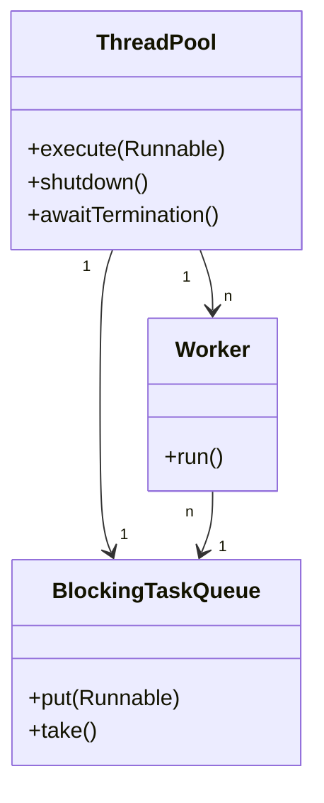
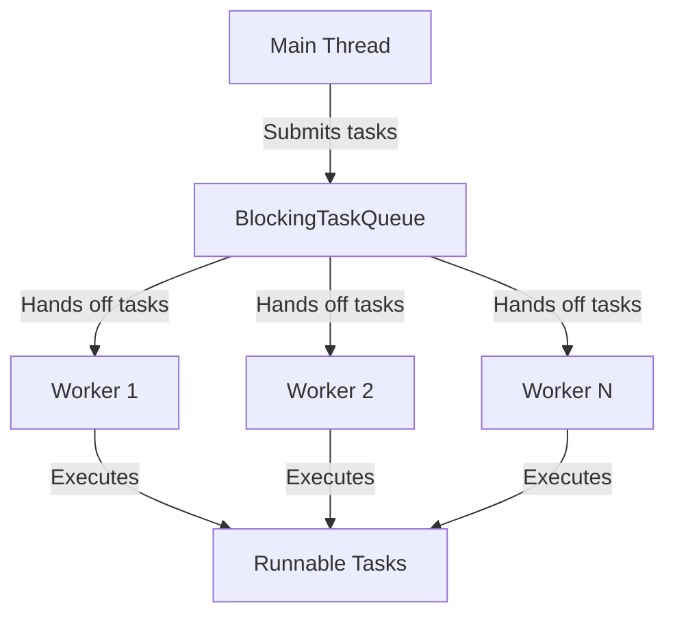

# Producer-Consumer Problem – Custom Java Implementations

This documentation covers a series of Java classes that implement the classic producer-consumer problem with increasing complexity and flexibility. The implementations demonstrate evolving concurrency design, moving from a **single-slot buffer** to a **thread pool** supporting multiple producers and consumers, culminating in a basic user-service framework. These solutions are written from scratch, reflecting the principles behind Java's `ArrayBlockingQueue` and thread pool executors.

---

## Evolution and Motivation

- **Step 1:** Start with a **single-slot buffer** to teach synchronization basics.
- **Step 2:** Introduce **multiple consumers**, showing the need for coordination (not just between one producer and one consumer).
- **Step 3:** Generalize to a **blocking queue** and a **thread pool**, as needed in real user-service frameworks.
- **Why Needed:** Real-world applications require concurrent processing of many tasks safely and efficiently, without busy-waiting or data loss.
- **Use Cases:** Logging systems, web servers, job schedulers, message queues, and any scenario where **work arrives asynchronously and must be processed concurrently by multiple workers.**

## Project Structure

This project is organized into two main folders: one for the single-slot implementation and another for the blocking task queue. Each folder demonstrates a different stage of the producer-consumer evolution.

- **singleSlot folder:**
  - `Buffer.java`
  - `Consumer.java`
  - `MainSingleSlot.java`
  - `Producer.java`
- **blockingQueue folder:**
  - `BlockingTaskQueue.java`
  - `MainThreadPool.java`
  - `ThreadPool.java`
  - `Worker.java`

---

# BlockingTaskQueue.java

This class implements a **blocking queue** for holding tasks, similar to Java's `ArrayBlockingQueue`, but from scratch. It is used as the core communication channel between producers (task submitters) and consumers (worker threads).


```java
public class BlockingTaskQueue {
    private final int capacity;
    private final Queue<Runnable> q = new LinkedList<Runnable>();
    private final Object lock = new Object();

    public BlockingTaskQueue(int capacity) { this.capacity = capacity; }

    public void put(Runnable task) throws InterruptedException {
        if (task == null) throw new NullPointerException("task");
        synchronized (lock) {
            while (q.size() == capacity) lock.wait();
            q.add(task);
            lock.notifyAll();
        }
    }

    public Runnable take() throws InterruptedException {
        synchronized (lock) {
            while (q.isEmpty()) lock.wait();
            Runnable task = q.poll();
            lock.notifyAll();
            return task;
        }
    }
}
```

## Key Features

- **Blocking `put`**: If the queue is full, producers wait.
- **Blocking `take`**: If the queue is empty, consumers wait.
- **Thread Safety**: Synchronization ensures only one thread accesses/modifies the queue at a time.
- **Generic**: Stores any `Runnable` task.

## Why This Is Needed

- Enables safe **sharing of work** between producers and consumers.
- **Prevents data loss** and **race conditions**.
- **Back-pressure**: If the queue is full, producers will not overrun the system.

## Typical Use Cases

- **Task scheduling**
- **Producer-consumer frameworks**
- **Implementing thread pools**

---

# ThreadPool.java

A simple **thread pool** implementation using the above `BlockingTaskQueue`. This class allows multiple tasks to be submitted and processed concurrently by a fixed set of worker threads.

```java
public class ThreadPool {
    final int capacity;
    volatile boolean isShutdown = false;
    final int workersCount;
    List<Thread> workers = new ArrayList<>();
    final BlockingTaskQueue blockingTaskQueue;
    static final Runnable POISON = () -> {};

    public ThreadPool(int capacity, int workersCount) {
        this.capacity = capacity;
        this.workersCount = workersCount;
        this.blockingTaskQueue = new BlockingTaskQueue(workersCount);
        for (int i = 0; i < workersCount; i++) {
            Thread t = new Thread(new Worker(blockingTaskQueue));
            workers.add(t);
            t.start();
        }
    }

    public void execute(Runnable task) throws InterruptedException {
        if (task == null) throw new NullPointerException("NULL Task");
        if (isShutdown) throw new IllegalStateException("Shutting down ThreadPool");
        blockingTaskQueue.put(task);
    }

    public void shutdown() throws InterruptedException {
        isShutdown = true;
        for (int i = 0; i < workersCount; i++) {
            blockingTaskQueue.put(POISON);
        }
    }

    public void awaitTermination() throws InterruptedException {
        for (Thread worker : workers) {
            worker.join();
        }
    }
}
```

## Key Features

- **Fixed-size worker pool**: Number of worker threads is specified at creation.
- **Graceful shutdown**: Uses a POISON task to signal workers to exit.
- **Submit tasks**: Producers can submit tasks using `execute`.
- **Block on full queue**: If the queue is at capacity, `execute` will block.
- **Wait for finish**: `awaitTermination` blocks until all worker threads finish.

## Why This Is Needed

- **Real-world scalability**: In a server or service, you need to process many tasks without creating a new thread for each.
- **Resource control**: Avoids thread explosion and controls concurrency level.
- **Reusability**: Threads are reused for multiple tasks.

## Scenarios Enabled

- **Web request handling**
- **Asynchronous processing**
- **Batch jobs**

---

## How ThreadPool, Worker, and BlockingTaskQueue Interact



---

# MainThreadPool.java

A simple **demo program** showing how the thread pool is used. The main thread acts as a producer, submitting tasks; the worker threads consume and execute them.

```java
public class MainThreadPool {
    public static void main(String[] args) throws InterruptedException {
        ThreadPool pool = new ThreadPool(10, 4);
        // Main is acting as a producer
        for (int i = 1; i <= 10; i++) {
            int finalI = i;
            pool.execute(() -> {
                System.out.println("Task " + finalI + " executed by " + Thread.currentThread().getName());
            });
        }
        pool.shutdown();
        pool.awaitTermination();
        System.out.println("All Threads are terminated");
    }
}
```

## Highlights

- **Demonstrates queueing and parallel execution**.
- **Main thread** produces tasks, **worker threads** execute them.
- **Shutdown** and **await termination** guarantee all tasks are finished before exit.

---

# Worker.java

Implements a **worker thread** that continually takes tasks from the queue and executes them, until it receives a **POISON** pill.

```java
public class Worker implements Runnable {
    BlockingTaskQueue blockingTaskQueue;
    public Worker(BlockingTaskQueue blockingTaskQueue) {
        this.blockingTaskQueue = blockingTaskQueue;
    }

    @Override
    public void run() {
        while (true) {
            try {
                Runnable task = blockingTaskQueue.take();
                if (task == ThreadPool.POISON) break;
                task.run();
            } catch (InterruptedException e) {
                throw new RuntimeException(e);
            }
        }
    }
}
```

## Key Points

- **Infinite loop**: Worker keeps fetching and running tasks.
- **POISON detection**: Clean shutdown when shutdown is requested.

---

# MainSingleSlot.java

This class is the **starting point** for understanding the producer-consumer problem: a single producer, multiple consumers, and a **single-slot buffer**.

```java
public class MainSingleSlot {
    public static void main(String[] args) throws InterruptedException {
        Buffer buffer = new Buffer();
        int producers = 1;
        int consumers = 11;
        List<Thread> producerThreads = new ArrayList<>();
        for (int i = 0; i < producers; i++) {
            Thread p = new Thread(new Producer(buffer), "Producer-" + i);
            producerThreads.add(p);
            p.start();
        }
        for (int i = 0; i < consumers; i++) {
            new Thread(new Consumer(buffer), "Consumer-" + i).start();
        }
        for (Thread p : producerThreads) {
            p.join();
        }
        System.out.println("PRODUCER DONE");
        for (int i = 0; i < consumers; i++) {
            buffer.produce(Producer.POISON);
        }
        System.out.println("Main exiting cleanly");
    }
}
```

## Key Features

- **Single-slot buffer**: Only one value at a time in the buffer.
- **Multiple consumers**: Shows need for coordinated access.
- **Poison pill**: Used to shut down consumers after production is done.

---

# Consumer.java

A **consumer thread** that repeatedly consumes values from the buffer and stops when it receives a `POISON` pill.

```java
public class Consumer implements Runnable {
    Buffer buffer;
    public Consumer(Buffer buffer) {
        this.buffer = buffer;
    }
    @Override
    public void run() {
        try {
            while (true) {
                int value = buffer.consume();
                if (value == Producer.POISON) {
                    System.out.println(Thread.currentThread().getName() + " receives poison, stooped.");
                    break;
                }
                System.out.println(Thread.currentThread().getName() + "consumes :" + value);
            }
        } catch (InterruptedException e) {
            throw new RuntimeException(e);
        }
    }
}
```

---

# Buffer.java

Implements a thread-safe **single-slot buffer** shared between producers and consumers.

```java
public class Buffer {
    private int data;
    private boolean hasData;
    final Object lock = new Object();

    public void produce(int value) throws InterruptedException {
        synchronized (lock) {
            while (hasData) lock.wait();
            data = value;
            hasData = true;
            lock.notifyAll();
        }
    }

    public int consume() throws InterruptedException {
        synchronized (lock) {
            while (!hasData) lock.wait();
            hasData = false;
            lock.notifyAll();
            return data;
        }
    }
}
```

## Why This Is Needed

- **Educational value**: Shows fundamental issues of sharing data across threads.
- **Foundation for more complex concurrency patterns**.

---

# Producer.java

Implements a **producer thread** that generates numbers and puts them into the buffer.

```java
public class Producer implements Runnable {
    Buffer buffer;
    public static final int POISON = -1;
    public Producer(Buffer buffer) { this.buffer = buffer; }
    @Override
    public void run() {
        for (int i = 0; i < 10; i++) {
            try {
                buffer.produce(i);
            } catch (InterruptedException e) {
                throw new RuntimeException(e);
            }
            System.out.println(Thread.currentThread().getName() + " produces: " + i);
        }
    }
}
```

---

# Progress and Evolution

| Step | Implementation            | Key Feature                                  | Limitation                  | Next Improvement      |
|------|--------------------------|----------------------------------------------|-----------------------------|----------------------|
| 1    | Single-slot Buffer       | Shows producer-consumer basics               | Only one item at a time     | Bounded buffer       |
| 2    | Multiple Consumers       | Demonstrates need for coordination           | Still single-slot           | Blocking queue       |
| 3    | BlockingTaskQueue        | Bounded, generic, blocks on full/empty       | Manual thread management    | Thread pool          |
| 4    | ThreadPool               | Dynamic user-service pattern, reusable       | No task prioritization      | Advanced features    |

---

# Use Cases and Scenarios Enabled

- **Logging pipelines**
- **Task scheduling**
- **Web server request handling**
- **Message passing between services**
- **Parallel data processing**
- **Multi-user server frameworks**

---

# Why Learn and Build From Scratch?

- **Deeper understanding**: Reinvents the wheel to teach the "why" and "how" behind `ArrayBlockingQueue`, executors, and thread pools.
- **Debugging skills**: Helps spot and solve deadlocks, race conditions, and starvation.
- **Design skills**: Shows trade-offs between simplicity, throughput, and safety in concurrent systems.

---

# Summary Table

| Class                  | Responsibility                                  | Real-world Equivalent         |
|------------------------|------------------------------------------------|------------------------------|
| `Buffer`               | Single-slot value exchange                      | Basic data-passing channel   |
| `Producer`/`Consumer`  | Producer/consumer threads                       | Data source/worker           |
| `BlockingTaskQueue`    | Thread-safe bounded queue                       | `ArrayBlockingQueue`         |
| `ThreadPool`           | Fixed-size thread pool managing tasks           | `ThreadPoolExecutor`         |
| `Worker`               | Executes tasks from queue                       | Worker thread in a pool      |
| `MainSingleSlot`       | Demo for single-slot system                     | Educational/test program     |
| `MainThreadPool`       | Demo for thread pool system                     | User-service entry point     |

---

# Example: ThreadPool in Action



---

# Best Practices

```card
{
    "title": "Best Practices for Producer-Consumer",
    "content": "Always use proper synchronization or ready-made thread-safe classes for concurrent data exchange to prevent race conditions and deadlocks."
}
```

---

# Conclusion

Building concurrent producer-consumer systems from scratch provides a **solid foundation for understanding real-world frameworks** like Java’s `ExecutorService` and `BlockingQueue`. These patterns are critical in high-performance, scalable applications—whenever you need to safely share work between many threads.

---

# Further Reading

- [Java Concurrency in Practice](https://jcip.net/)
- [Official Java Thread Pools](https://docs.oracle.com/javase/tutorial/essential/concurrency/pools.html)
- [Producer-Consumer Pattern](https://en.wikipedia.org/wiki/Producer–consumer_problem)

---

# 🚦 Next Steps

- Add task prioritization or rejection policies.
- Plug in monitoring/metrics for the queue and pool.
- Support for dynamic thread pool resizing.

---

If you want to see how Java's built-in classes compare, look up [`ArrayBlockingQueue`](https://docs.oracle.com/javase/8/docs/api/java/util/concurrent/ArrayBlockingQueue.html) and [`ThreadPoolExecutor`](https://docs.oracle.com/javase/8/docs/api/java/util/concurrent/ThreadPoolExecutor.html)!

---
